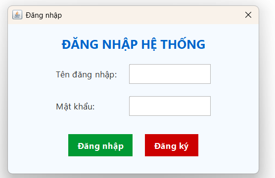
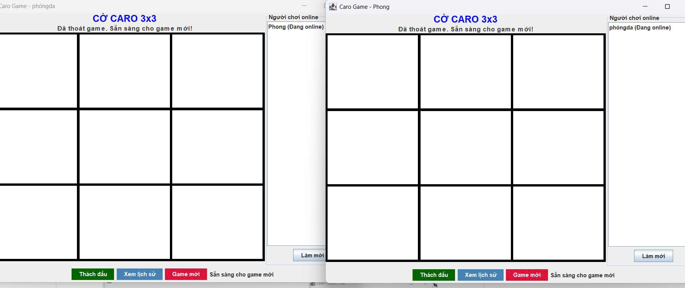
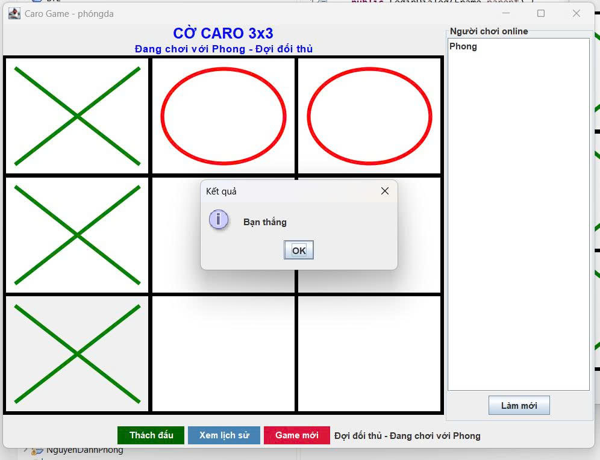
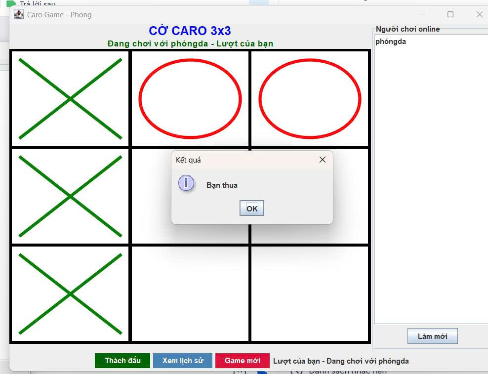
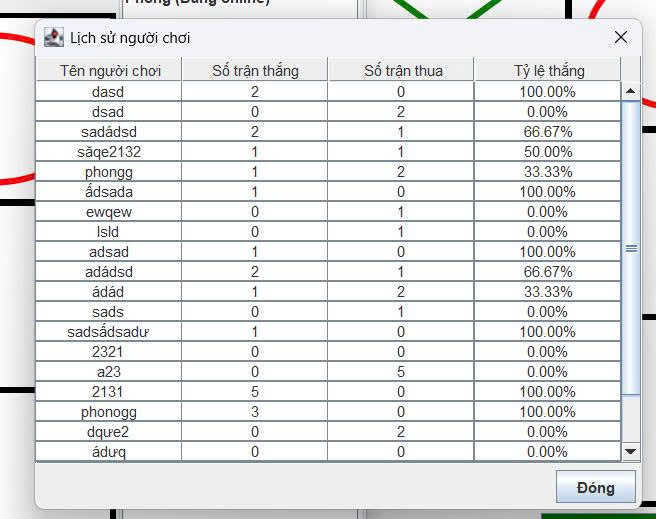

<h2 align="center">
    <a href="https://dainam.edu.vn/vi/khoa-cong-nghe-thong-tin">
    🎓 Faculty of Information Technology (DaiNam University)
    </a>
</h2>

<h2 align="center">
   Game Tic Tac Toe (Caro 3x3)
</h2>

<div align="center">
    <p align="center">
        
        
        
    </p>

[](https://www.facebook.com/DNUAIoTLab)
[](https://dainam.edu.vn/vi/khoa-cong-nghe-thong-tin)
[](https://dainam.edu.vn)

</div>

---
## 📖 1. Giới thiệu hệ thống
Ứng dụng Game Caro 3x3 sử dụng giao thức TCP cho phép nhiều người chơi thách đấu và thi đấu với nhau qua mạng.<br>
**Client** : cung cấp giao diện chơi game và thách đấu.<br>
**Server** : đóng vai trò trung tâm, quản lý kết nối, trận đấu và lịch sử người chơi.<br>
**Lưu trữ dữ liệu** : lịch sử người chơi (thắng/thua) được lưu vào file văn bản. 

Client có giao diện Java Swing, cho phép người dùng:
- Đăng nhập/nhập tên người chơi.  
- Chơi cờ Caro 3x3 trực tuyến theo thời gian thực.  
- Xem thông báo khi thắng, thua hoặc hòa.  

Giao thức TCP được chọn vì tính đảm bảo truyền tin cậy:  
- Không mất gói dữ liệu (các nước đi được truyền đầy đủ, chính xác).  
- Duy trì kết nối liên tục cho đến khi trận đấu kết thúc.  

## 🛠 2. Các chức năng chính

### **Server**
🔌 **Kết nối & Quản lý** – Port `8000`, hỗ trợ đa luồng  
🎯 **Quản lý trận đấu** – Logic game Caro 3x3  
📊 **Theo dõi thống kê** – Thắng/thua của người chơi  
💾 **Lưu trữ lịch sử** – File `player_history.txt`  
👥 **Quản lý Client** – Danh sách người chơi online  

### **Client**
🔗 **Kết nối đến Server** – Giao tiếp qua TCP  
🎨 **Giao diện đồ họa** – Java Swing  
⚡ **Thách đấu real-time** – Chọn người chơi online  
🎮 **Chơi game Caro** – X màu xanh, O màu đỏ  
📊 **Xem lịch sử** – Thống kê người chơi  
🔄 **Làm mới** – Reset bàn cờ và trạng thái  

### **Hệ Thống**
🌐 **Giao thức TCP** – `ServerSocket` và `Socket`, đa luồng  
💾 **Lưu trữ dữ liệu** – File I/O cho lịch sử người chơi  
🛡️ **Xử lý Lỗi** – Thông báo lỗi trong GUI, debug log  
🏆 **Logic game** – Kiểm tra thắng thua 3x3  

### 🎲 **Luật Chơi**
🟩 **Bàn cờ:** 3x3 (9 ô)  
🏆 **Thắng:** khi có 3 quân liên tiếp theo **hàng**, **cột** hoặc **chéo**  
🤝 **Hòa:** khi bàn cờ đã đầy mà **không có ai thắng**  
🎨 **Ký hiệu:**  
  - ❌ X = màu xanh  
  - ⭕ O = màu đỏ    
📌 **Ví dụ bàn cờ thắng:**

        ❌ ⬜ ⭕
        ⬜ ❌ ⭕
        ⬜ ⬜ ❌
---

## 🔧 2. Công nghệ sử dụng
[](https://www.java.com/)
[](https://www.sqlite.org/)

---

## 🚀 3. Hình ảnh các chức năng

<p align="center">
  
</p>

<p align="center">
  <em>Hình 1: Giao diện đăng nhập </em>
</p>

<p align="center">
  
</p>
<p align="center">
  <em> Hình 2: Giao diện Cờ Caro(3x3)</em>
</p>


<p align="center">
  
 
</p>
<p align="center">
  <em> Hình 3: Giao diện bạn thắng </em>
</p>

<p align="center">
    
</p>
<p align="center">
  <em> Hình 4: Giao diện bạn thua</em>
</p>

<p align="center">
  
</p>
<p align="center">
  <em> Hình 5: Giao diện lịch sử thắng hoặc thua</em>
</p>

---

## ⚙️ 4. Các bước cài đặt & Chạy ứng dụng 

### 🛠️ 4.1. Yêu cầu hệ thống
- **Java Development Kit (JDK)**: Phiên bản 8 trở lên
- **Hệ điều hành**: Windows, macOS, hoặc Linux
- **Môi trường phát triển**: IDE (IntelliJ IDEA, Eclipse)
- **Bộ nhớ**: Tối thiểu 512MB RAM
  
### 📥 4.2. Các bước cài đặt
#### 🧰 Bước 1: Chuẩn bị môi trường
1. **Cài đặt Java**  
   Dự án yêu cầu **JDK 8** trở lên (JDK 21 cũng chạy được).  
   Kiểm tra bằng:
   ```bash
   java -version
   javac -version
Đảm bảo cả hai lệnh hiển thị phiên bản >= 8.
2. Cấu trúc thư mục dự án
    BTLTicTacToe/
└── src/
     ├── client/        # Code giao diện và logic phía client
     ├── server/        # Code xử lý server & quản lý kết nối
     └── shared/        # Các class dùng chung giữa client & server
   
#### 🏗 Bước 2: Biên dịch mã nguồn
1. Mở terminal và điều hướng đến thư mục dự án:
   cd D:\Download\BTLTicTacToe>
2. Biên dịch tất cả file Java
   javac *.java
#### ▶️ Bước 3: Chạy ứng dụng
Khởi động Server:
    java -cp bin server.CaroServer
Server sẽ khởi động trên port mặc định (8000) bạn có thể thay đổi.

Giao diện server sẽ hiển thị và sẵn sàng nhận kết nối từ client

Khởi động Client:
    java -cp bin client.CaroClient
Mở terminal mới cho mỗi client muốn tham gia

Nhập tên người dùng khi được yêu cầu đăng nhập (ví dụ: Phóng, Trường, Long)

Client sẽ kết nối đến server và hiển thị giao diện Cờ Caro (3x3)

### 🚀 Cách sử dụng ứng dụng
1. Đăng nhập: Nhập tên người chơi khi mở client.
2. Xem danh sách online: Chọn người chơi khác và bấm nút Thách Đấu.
3. Chơi game:
   - X màu xanh, O màu đỏ
   - Thắng khi có 3 ô liên tiếp hàng/cột/chéo
   - Hòa khi bàn cờ đầy mà không ai thắng
4. Lịch sử người chơi: Mở cửa sổ thống kê để xem số trận thắng/thua.
5. Kết thúc: Đóng cửa sổ hoặc nhấn Ctrl+C trong terminal để thoát.
## 📞 5. Liên hệ
**Email** : danhphong200412@gmail.com 
**Github**: https://github.com/NguyenDanhPhong270604/LTM-Game-Tic-Tac-Toe-Caro-3x3-

© 2025 AIoTLab, Faculty of Information Technology, DaiNam University. All rights reserved.
